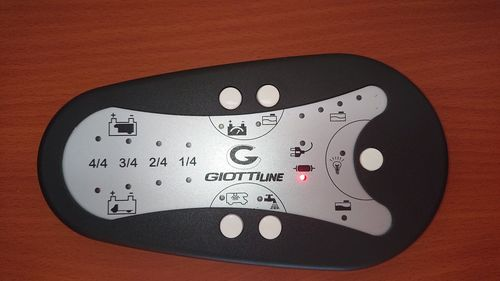
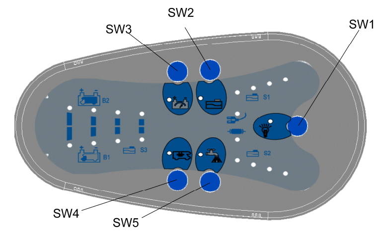
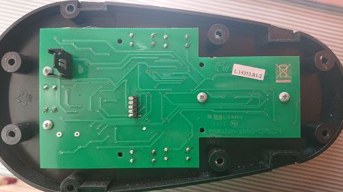
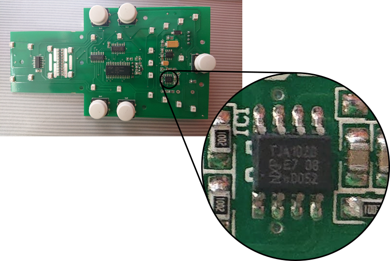

# Elektroblock ArSilicii CP5L24
Dieser Elektroblock ist in unserm Giottline W63 und m.W. auch in manchen Rimor-Fahrzeugen verbaut. Hier sind meine Erkenntnisse über die Kommunikation zwischen dem Bedienteil und dem Elektroblock dokumentiert. Ferner gibt es unter `/src` noch einige Hilfprogramme, z.B. eine MQTT-Bridge in python nebst `systemd`-unit.
So sieht das Bedienteil bei uns aus:  
  
Hier ist die Anleitung zu dem System: https://www.manualslib.de/manual/685837/Arsilicii-Al-Bk20.html  
im Foglenden beziehe ich mich auf diese Abbildung daraus:  
  
Oben rechts ist die Füllstandsanzeige Frischwasser S1, unten rechts Grauwasser S2, unten links Grauwasser S3 (kombiniert mit Spannung Aufbaubatterie B1). Bei unserem Bedienteil guckt von S2 jedoch nur die dritte LED hervor. Auch nur diese leuchtet, allerdings bei Aktivierung von EBL-Verbinder JP8, Pin 2, "Grauwassersensor S2 niedrig" (statt "mittel").  
Die Anzeige S3 ist außer Betrieb, deren LEDs werden nur als B1 benutzt.  
Außerdem gibt es eine orange LED mittig zwischen den LEDs "Landstrom" und "Sicherung draußen". Guckt bei keinem Bedienteil nach vorn durch, aber leuchtet orange bei Aktivierung von EBL-Verbinder JP9, Pin 6, "Frischwassersensor S1 Überlauf".  
Innenansichten unseres Bedienteils:  
  
  

## Grundlagen des Busses
Das Bedienteil kommuniziert seriell über einen Draht mit dem Elektroblock. Der physische Layer ist soweit ich sehen kann der des [LIN](https://www.cs-group.de/wp-content/uploads/2016/11/LIN_Specification_Package_2.2A.pdf), es ist ein TJA2020-LIN-Transceiver im Bedienteil verbaut, s. Bild. Die Frames sind jedoch anders aufgebaut, es gibt z.B. kein Break Field und kein Sync Field (evtl. dient das untenstehende `0x55`als solches).  
Das Bedienfeld ist der Master, der Elektroblock der Slave.  
Datenübertragung erfolgt mit dem LSB (Bit 0) zuerst.  
Der Master startet etwa alle 8,2 ms einen Frame mit dem Senden eines von 7 verschiedenen PID-Bytes in UART-Konfiguration 8O1, also Odd-Parity. Die Frameanfänge werden immer in dieser Reihenfolge wiederholt:  
`0x55 0x78 0x49 0xBA 0x55 0xA6 0x8B 0x64`  
Alle PIDs erfüllen die LIN-Partität:  
Bit6 = Bit0 ⊻ Bit1 ⊻ Bit2 ⊻ Bit4  
Bit7 = ¬(Bit1 ⊻ Bit3 ⊻ Bit4 ⊻ Bit5)  
(⊻: XOR; ¬: NOT)

Immer nach PID `0x78` und nur dann folgen noch innerhalb des 8,2-ms-Frames zwei weitere Bytes vom Master in UART-Konfiguration 8E1, also Even-Parity. Beide Bytes sind stets identisch, vermutlich zur Fehlererkennung (nicht identisch: Übertragungsfehler - man kann auch das zweite Byte als bitweise XOR-Checksumme des ersten verstehen wie in der Antwort des Slave, s.u.). 

Nach jedem `0xBA` oder `0x78 0x__ 0x__` und nur dann antwortet der Slave mit je 5 Bytes ebenfalls in 8E1. Das 5. Byte ist eine bitweise [XOR-Checksumme](https://en.wikipedia.org/wiki/Checksum#Parity_byte_or_parity_word) über die anderen 4 Bytes:  
Byte 4 = Byte 0 ⊻ Byte 1 ⊻ Byte 2 ⊻ Byte 3  
Die XOR-Checksumme über alle 5 Bytes ergibt also `0x00` bei korrekter Übertragung.

In den folgenden Tabellen bedeutet ein fester Wert bei "Funktion", dass ich diesen Wert dort konstant auslese. Dass er sich unter Umständen jemals ändert und damit eine Bedeutung hat, ist aber nicht ausgeschlossen.

## Schaltbefehle
Schaltbefehle werden vom Master an den Slave in den beiden o.g. Bytes nach `0x78` übertragen. Innerhalb jedes Bytes haben die Bits die folgende Bedeutung:

Bit|Funktion|Bedeutung
---:|--- |---
7|Füllstandsabfrage (SW2)|aktiv: 0, inaktiv: 1
6|0
5|0
4|0
3|0
2|Außenlicht (SW4)|inaktiv: 0, aktiv: 1
1|Licht (SW1)|inaktiv: 0, aktiv: 1
0|Pumpe (SW5)|inaktiv: 0, aktiv: 1

Die Abfrage der Batteriespannungen (SW3) wird nicht an den EBL übertragen.

## Status
In der Antwort des Slave auf PID `0xBA` stecken folgende Statusbits zu den Relais und s/w-Sensoren (jeweils inaktiv: 0, aktiv: 1):

Byte|Bit|Funktion
---:|---:|---
0|7|0
0|6|0
0|5|0
0|4|0
0|3|0
0|2|Außenlicht
0|1|Licht
0|0|Pumpe
1|7|Grauwasser S2 voll
1|6|Grauwasser S2 mittel
1|5|Grauwasser S2 niedrig
1|4|1
1|3|Frischwasser S1 voll   
1|2|Frischwasser S1 mittel 
1|1|Frischwasser S1 niedrig
1|0|1
2|7|0
2|6|Frischwasser S1 Überlauf
2|5|Landstrom
2|4|0
2|3|0
2|2|0
2|1|Sicherung draußen
2|0|0
3|7|0
3|6|0
3|5|0
3|4|0
3|3|Grauwasser S3 voll
3|2|Grauwasser S3 mittel
3|1|Grauwasser S3 niedrig
3|0|1

## Spannungswerte
In der Antwort des Slave auf PID `0x78`, unabhängig von den 2 Befehlsbytes des Masters, stecken diese Werte:

Byte|Funktion|Wert
---:|---|---:
0|0|
1|Spannung Aufbaubatterie|1/10 V
2|0|
3|Spannung Starterbatterie|1/10 V

Die LEDs am Bedienpanel leuchten folgendermaßen in Abhängigkeit von Byte 1 bzw. Byte 3:
Wertebereich|Spannungsbereich / V|LEDs
---|---|---
000...100|0...10,0|rot blinkt
101...110|10,1...11,0|rot leuchtet
111...120|11,1...12,0|1x grün
121...128|12,1...12,8|2x grün
129...255|12,9...25,5|3x grün
