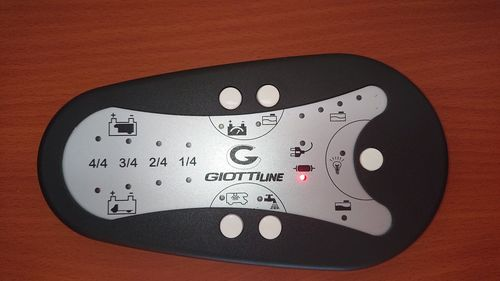

# Elektroblock ArSilicii CP5L24
Dieser Elektroblock ist in unserm Giottline W63 verbaut. Hier sind meine Erkenntnisse über die Kommunikation zwischen dem Bedienteil und dem Elektroblock dokumentiert.

## Grundlagen des Busses
Das Bedienteil kommuniziert seriell über einen Draht mit dem Elektroblock. Der physische Layer ist soweit ich sehen kann der des [LIN](https://www.cs-group.de/wp-content/uploads/2016/11/LIN_Specification_Package_2.2A.pdf), es sind LIN-Transceiver im Bedienteil verbaut. Die Frames sind jedoch anders aufgebaut, es gibt z.B. kein Break field und kein Sync field.  
Das Bedienfeld ist der Master, der Elektroblock der Slave.  
Datenübertragung erfolgt mit dem LSB zuerst.  
Der Master startet etwa alle 8,2 ms einen Frame mit dem Senden eines von 7 verschiedenen PID-Bytes in UART-Konfiguration 8**O**1, also Odd-Parity. Die Frameanfänge werden immer in dieser Reihenfolge wiederholt:  
`0x55 0x78 0x49 0xBA 0x55 0xA6 0x8B 0x64`  
Die PIDs erfüllen die LIN-Partität:  
Bit6 = Bit0 ⊻ Bit1 ⊻ Bit2 ⊻ Bit4  
Bit7 = ¬(Bit1 ⊻ Bit3 ⊻ Bit4 ⊻ Bit5)  
(⊻: XOR; ¬: NOT)

Immer nach PID `0x78` und nur dann folgen noch innerhalb des 8,2-ms-Frames zwei weitere Bytes vom Master in UART-Konfiguration 8**E**1, also Even-Parity. Beide Bytes sind stets identisch, vermutlich zur Fehlererkennung (nicht identisch: Übertragunsfehler). 

Nach jedem `0xBA` oder `0x78 0x__ 0x__` und nur dann antwortet der Slave mit je 5 Bytes ebenfalls in 8**E**1. Das 5. Byte ist eine bitweise [XOR-Checksumme](https://en.wikipedia.org/wiki/Checksum#Parity_byte_or_parity_word) über die anderen 4 Bytes:  
Byte 5 = Byte 1 ⊻ Byte 2 ⊻ Byte 3 ⊻ Byte 4  
Die XOR-Checksumme über alle 5 Bytes ergibt also `0x00` bei korrekter Übertragung.

## Schaltbefehle
Schaltbefehle werden vom Master an den Slave in den beiden o.g. Bytes nach `0x78` übertragen. Innerhalb jedes Bytes haben einzelne Bits die folgende Bedeutung, jeweils '1' schaltet ein, '0' schaltet aus:

Funktion|Bit #
---|---
Pumpe|0
Licht|1
Außenlicht|2
?|7

Alle anderen Bits sind bei mir bisher immer 0. Das Bedienteil hat auch nur 5 Knöpfe, 2 davon werden nicht an den Slave übermittelt (dienen der lokalen Anzeige der Sensoren), daher bleiben nur die o.g. 3 Befehle. Bit 7 ändert sich trotzdem, die Abhängigkeit ist derzeit noch unklar.

## Status
In der Antwort des Slave auf PID `0xBA` stecken Statusbits zu den Relais und s/w-Sensoren, jeweils '1' für aktiv und '0' für inaktiv:

Status|Byte #|Bit #
---|---|---
Pumpe|1|0
Licht|1|1
Außenlicht|1|2
Frischwassersensor unten|2|1
Frischwassersensor mittig|2|2
Frischwassersensor oben|2|3
Grauwassersensor oben|?|?
Sicherung draußen|3|1

## Spannungswerte
In der Antwort des Slave auf PID `0x78`, unabhängig von den 2 Befehlsbytes des Masters, stecken diese Spannungswerte:

Spannung|Byte #|Wert
---|---|---
Aufbaubatterie|2|1/10 V
Starterbatterie|4|1/10 V